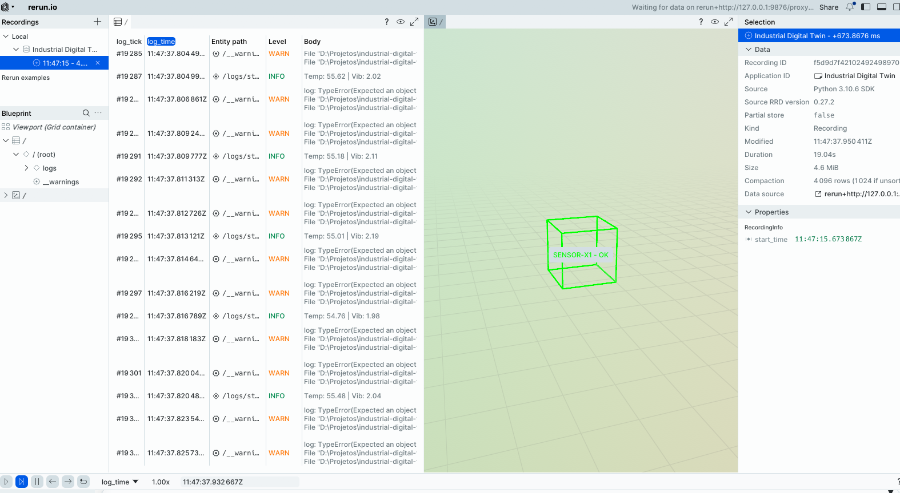

# 🏭 Industrial Digital Twin (IoT & Event-Driven Architecture)


> **Projeto de demonstração técnica de Arquitetura de Microsserviços Distribuídos, Resiliência e Visualização de Dados em Tempo Real.**

Este projeto simula um ambiente industrial onde sensores IoT enviam telemetria de alta frequência via **Apache Kafka**. O sistema processa anomalias usando **Spring Boot WebFlux**, gerencia falhas de integração com **Apache Camel** e **Resilience4J**, e projeta um Gêmeo Digital em 3D usando **Python (Rerun.io)**.

---

## 🏗️ Arquitetura do Sistema

O sistema segue uma abordagem **Poliglota** e **Event-Driven**, desacoplando produtores e consumidores para máxima escalabilidade.



### Componentes:

1.  **📡 Sensor Emitter (Edge Computing):**
    *   **Tech:** Java 17, **Quarkus**.
    *   **Função:** Simula turbinas industriais gerando ondas senoidais (Temperatura, Vibração, Rotação) e injeta anomalias estocásticas.
    *   **Design:** Baixo footprint de memória, Clean Architecture, Reactive Messaging.

2.  **📨 Event Bus (Backbone):**
    *   **Tech:** **Apache Kafka** (Modo KRaft - sem Zookeeper).
    *   **Função:** Garante desacoplamento temporal e buffering de mensagens de alto throughput.

3.  **🧠 Anomaly Detector (Core):**
    *   **Tech:** Java 17, **Spring Boot 3**, WebFlux.
    *   **Função:** Consome streams do Kafka, aplica algoritmo de detecção de threshold (Z-Score simplificado) e identifica riscos críticos.

4.  **🛡️ Integration & Resilience (Self-Healing):**
    *   **Tech:** **Apache Camel**, **Resilience4J** (Circuit Breaker).
    *   **Função:** Roteia alertas para sistemas externos.
    *   **Pattern:** Implementa **Graceful Degradation**. Se a API externa falhar, o **Circuit Breaker** abre e o sistema faz fallback salvando os dados críticos em disco (`backup-alerts`), prevenindo perda de dados.

5.  **👁️ Digital Twin Viewer (Visualization):**
    *   **Tech:** Python, **Rerun.io SDK**.
    *   **Função:** Renderização 3D em tempo real do estado da máquina.
    *   **Feature:** A caixa 3D muda de cor e pulsa baseada na vibração recebida via Kafka.

---

## 🚀 Tecnologias e Padrões Utilizados

Este projeto foi desenhado para cobrir requisitos de sistemas corporativos modernos:

*   **Microsserviços:** Separação clara de responsabilidades (Ingestão vs Processamento).
*   **Mensageria Assíncrona:** Kafka para lidar com picos de carga.
*   **Clean Architecture:** Domínio isolado de frameworks nos serviços Java.
*   **Fault Tolerance:** Uso de Circuit Breakers para impedir falhas em cascata.
*   **Infrastructure as Code:** Ambiente completo via Docker Compose.
*   **Observabilidade Visual:** Monitoramento via Rerun.io e logs estruturados.

---

## 🛠️ Como Executar

### Pré-requisitos
*   Docker & Docker Compose
*   Java JDK 17+
*   Maven 3.8+
*   Python 3.8+

### Passo 1: Infraestrutura (Docker)
Inicie o Kafka e o Kafdrop.
```bash
docker-compose up -d
```
*Acesse o painel do Kafka em: http://localhost:9000*

### Passo 2: Gerador de Sensores (Quarkus)
Em um terminal, inicie o simulador de IoT:
```bash
cd sensor-emitter
mvn quarkus:dev
```

### Passo 3: Detector de Anomalias (Spring Boot)
Em outro terminal, inicie o backend de processamento:
```bash
cd anomaly-detector
mvn spring-boot:run -Dspring-boot.run.arguments="--server.port=8081"
```

### Passo 4: Visualizador 3D (Python)
Instale as dependências e rode o dashboard:
```bash
pip install rerun-sdk kafka-python
python digital_twin_viewer.py
```

---

## 🧪 Cenário de Teste (Simulação)

1.  O **Sensor Emitter** envia dados normais (Vibração < 5.0).
    *   *Visual:* Cubo Verde no Rerun. Log `✅` no Spring.
2.  O sistema injeta aleatoriamente uma **Anomalia** (Vibração > 10.0).
    *   *Visual:* Cubo Vermelho pulsando.
3.  O **Anomaly Detector** identifica o risco e tenta notificar a API de Manutenção.
4.  Como a API externa não existe (simulação de falha), o **Resilience4J** ativa o **Fallback**.
5.  O alerta é salvo com segurança na pasta `anomaly-detector/backup-alerts`.

---

## 📂 Estrutura do Projeto

```bash
industrial-digital-twin/
├── docker-compose.yml       # Infraestrutura (Kafka, Kafdrop)
├── digital_twin_viewer.py   # Dashboard Python (Rerun)
├── sensor-emitter/          # Microsserviço Quarkus (Producer)
│   └── src/main/java/.../domain  # Clean Arch: Entidades puras
├── anomaly-detector/        # Microsserviço Spring Boot (Consumer)
│   └── src/main/java/.../integration # Rotas Camel + Resilience4J
└── README.md
```

---

## 👤 Autor

**Benjamim Alves N. Neto**
*Computer Scientist | Senior Java Developer*
[[LinkedIn](https://www.linkedin.com/in/benjamim-neto-a55158230/)]

> *"Arquitetura de software é sobre tomar decisões difíceis entre trade-offs. Este projeto demonstra a escolha pela Consistência Eventual e Alta Disponibilidade em um ambiente industrial crítico."*